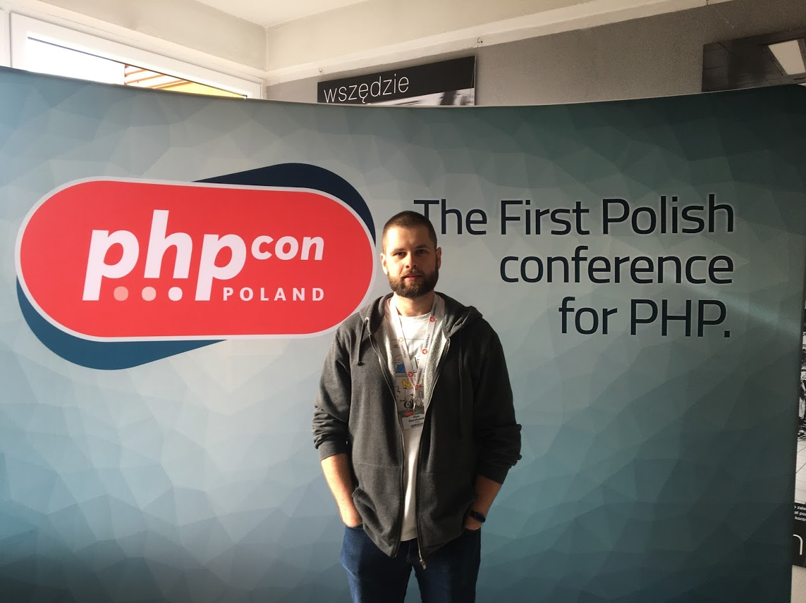

Na samym początku chciałbym Ci podziękować, za odwiedziny na blogu. Jest mi niezmiernie miło, że poświęcasz swój czas,
aby tu przyjść i czytać, co mam do przekazania. 

# Kim jestem

No to od początku…

Cześć!
Jestem Piotr.

Od kiedy pamiętam, interesowałem się IT i całą otoczką webdev. Od kilku lat spełniam się zawodowo jako programista.
Pamiętam czasy Pajączka, programu WebMajster (hosting na republika.pl, ktoś kojarzy?), a nawet tworzenia stron WWW w 
Wordzie :)

Prywatnie: strzelanki (Quake wiecznie żywy), koszykówka.

# O blogu

Może zacznijmy od tego, skąd pomysł na blog. Mówią, że dawanie daje więcej radości niż branie. Nadal pamiętam pierwszy 
feedback do paczki, którą opublikowałem. Naprawdę fajne uczucie, że ktoś zauważył i korzysta z mojego rozwiązania. 
No i od tego się zaczęło.

Zamierzam pisać o wszystkim, z czym się spotykam jako programista. Nie tylko bezpośrednio o kodzie, ale też o podejściu 
do rozwiązywania problemów, czy o zdrowiu. Cała otoczka życia developera. Nie bez powodu nazwałem blog Notatki Deva.
